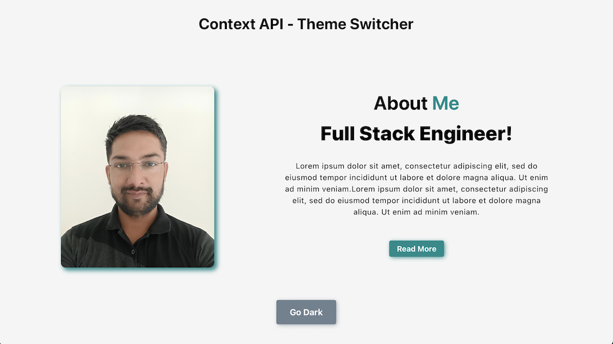
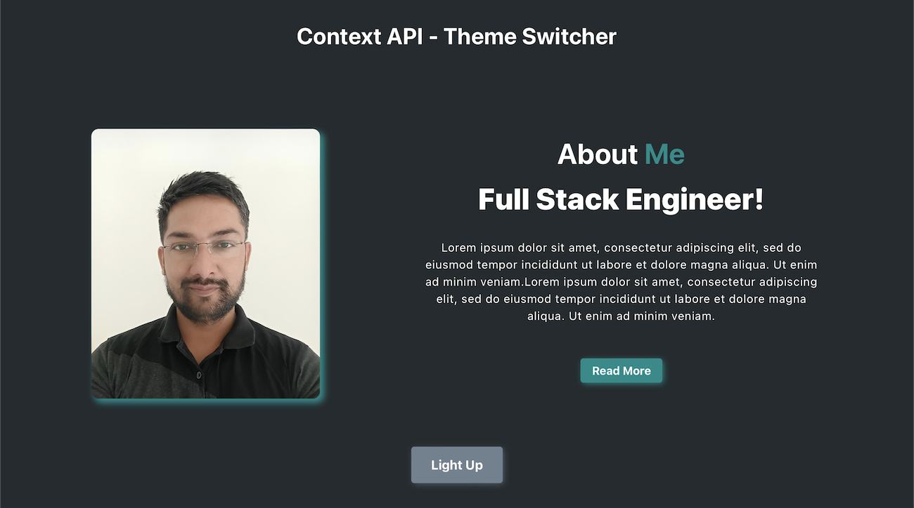

# **Context API - Theme Switcher App**

This is a simple dashboard app built in react JS and features the theme changing functionality.

 

## Features
- This app provides the functionality of theme changing from light to dark on a button click.
- Context API is used to create context of the theme and used as props in the dashboard component.
- Application is responsive, working perfectly and deployed on netlify.

 

## Screenshots

 

### Light Mode

 

### Dark Mode

 

## **Deployed Link**

 